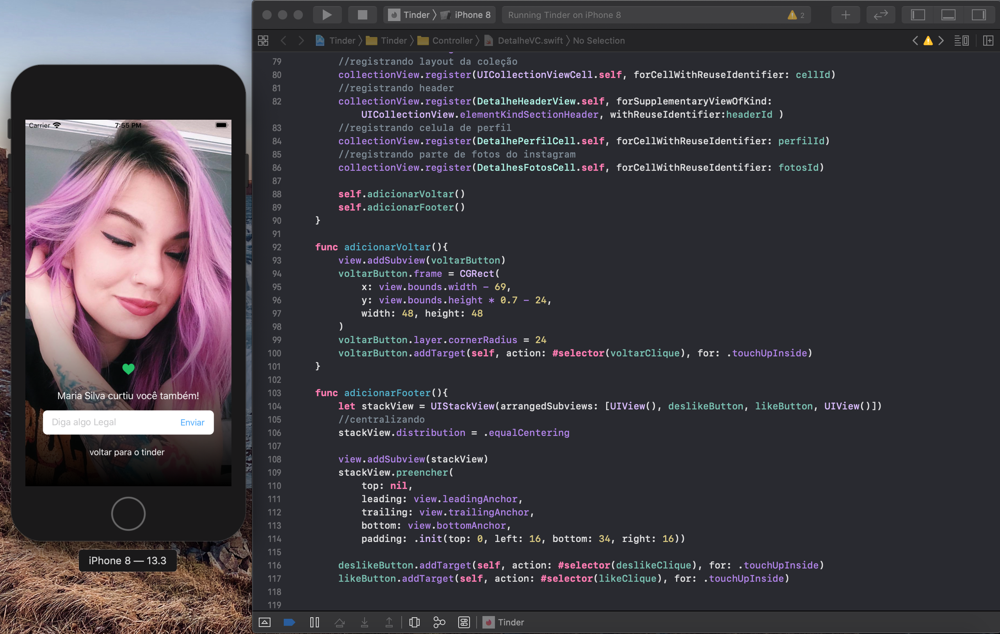
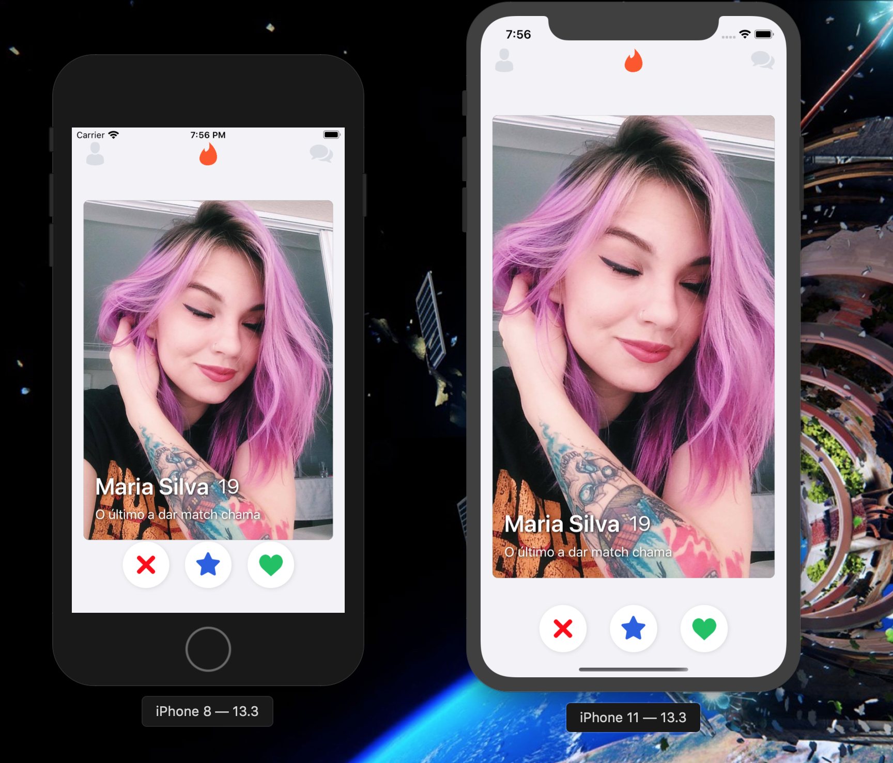
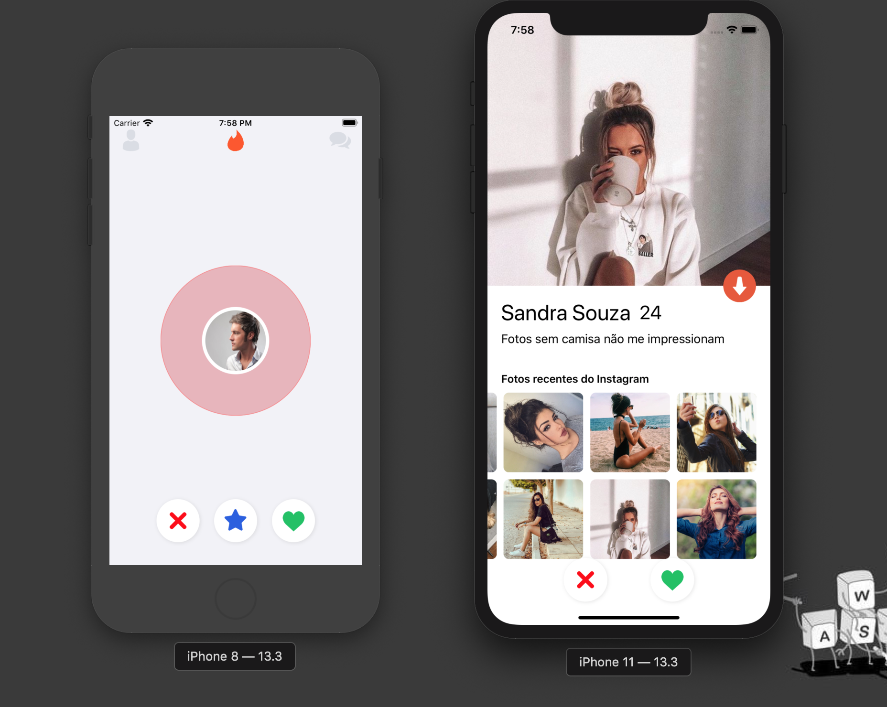

# Tinder Clone

### App Desenvolvido em Swift.

## Sobre o App:

### Como o próprio nome ja diz, esse app se trata de um clone com funcionalidades basicas do app Tinder, Desenvolvido em Swift 5 e IOS 13.

### O app se entende com dados estaticos, e algumas Funções, as funções principais se encontram nos botões inferios do app (passar, super like e like), essas funções também estão atribuidas aos gestos como no App tradicional (Arrastar para a direita e esquerda).

# Algumas capturas de Tela da Aplicação:

## Tela Principal

## Tela de Detalhes e Modal de mensagem de Match

## Tela de Loading e Detalhes

